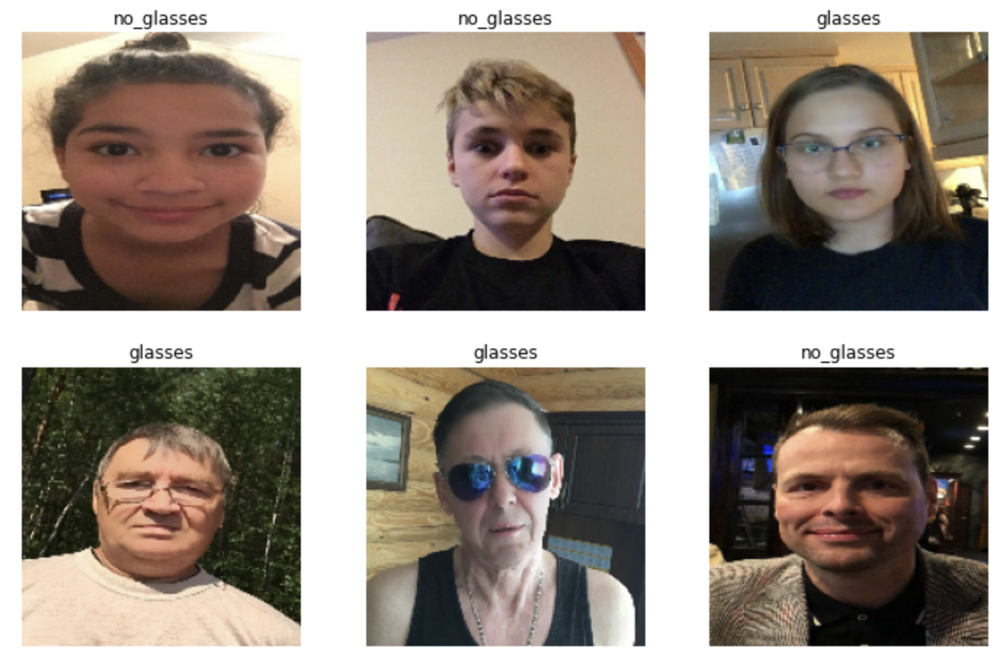

## General Description
- For training the model it was utilized the generated dataset named `Glasses or No Glasses`.
- For the model architecture it was used Google `MobilNetV2`.
    - Out of the box model showed `0.6131` accuracy. 
    - Afterwards the model was trained on 10 epochs and obtained `0.9028` accuracy. 
    - On top it was decided unfreeze certain layers and train 5 more epochs what allows to obtain `0.9958` accuracy.  

## Converting model into TFLite format for mobile usage
TensorFlow Lite is a set of tools to help developers run TensorFlow models on mobile,
embedded, and IoT devices. It enables on-device machine learning inference with low latency and a small binary size.    

## Model Training
The process of model training was accomplished within Google Colab and can be investigated at `GlassesClassification.ipynb` notebook.

- The entire model is saved at `checkpoints/model/`
- Related process constants are saved at `configurations.py`

## Invoke Inference of the model
```bash
python inference.py --path <PATH_TO_DATASET_FOLDER>  
```   

### Visualisation of sample batch of test images
